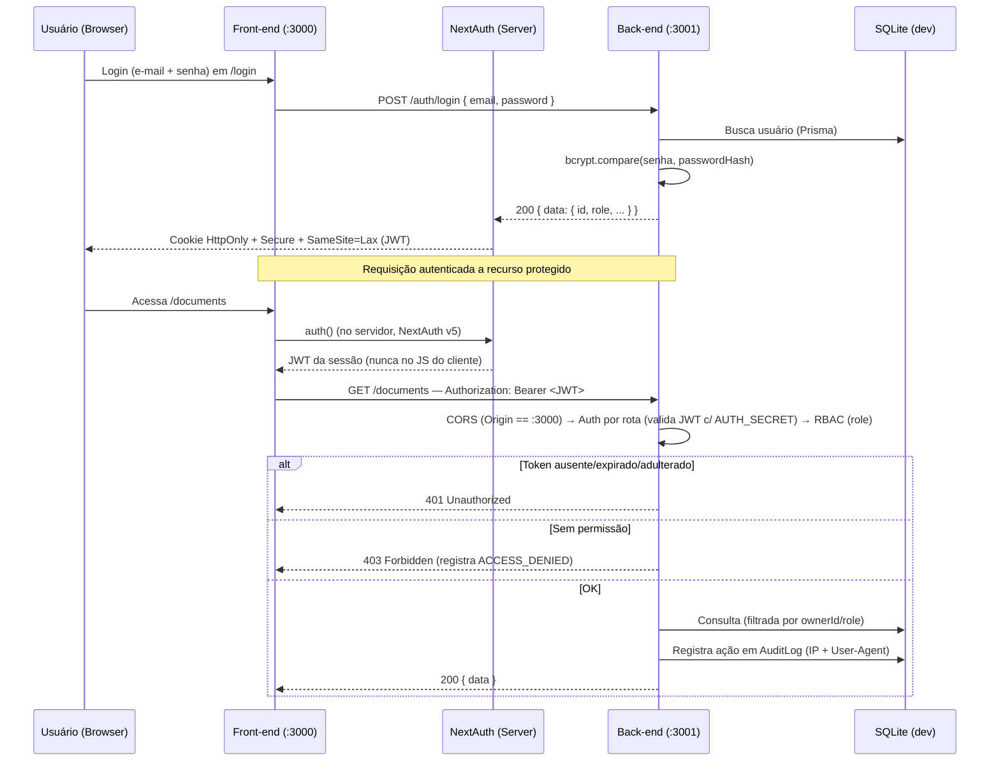

# 📄 Relatório Técnico Parcial — Arquitetura do Sistema Draft

| Campo | Valor |
|---|---|
| **Projeto** | Draft — Gestão de Documentos (P06-B) |
| **Disciplina** | Segurança da Informação (N3) — Prof. Edson Vaz Lopes |
| **Instituição** | Católica SC — Engenharia de Software |
| **Frente** | SecOps e Documentação — Evidências e Planos de Continuidade |
| **Responsável** | Vinícius Steuernagel |
| **Escopo** | Arquitetura **atual** (entrega parcial — checkpoint técnico) |

---

## 1. Visão Geral

O **Draft** é uma aplicação web para gestão de documentos fictícios (contratos e termos) com versionamento, fluxo de aprovação, responsáveis e histórico de alterações. Segue o princípio de **Security by Design**: a separação física entre interface e API, a autenticação por token e a trilha de auditoria forense são parte do desenho, não acréscimos posteriores.

A arquitetura é **desacoplada em dois repositórios Next.js 14 (App Router)**:

- **`draft-frontend` (:3000)** — apenas interface React (sem API Routes); gerencia a sessão e faz chamadas autenticadas ao back-end.
- **`draft-backend` (:3001)** — apenas API Routes (sem interface); valida tokens, aplica regras de negócio e acessa o banco via Prisma.

---

## 2. Arquitetura em Alto Nível

```
Browser (usuário)
  │
  ▼
┌──────────────────────────┐    HTTP/JSON  +  Authorization: Bearer <JWT>
│  FRONT-END  (:3000)      │ ───────────────────────────────────────────────▶ ┌──────────────────────────┐
│  Next.js 14 (App Router) │                                                    │  BACK-END  (:3001)       │
│  • React + Tailwind      │ ◀─────────────────────────────────────────────── │  Next.js 14 (API Routes) │
│  • NextAuth.js v5        │              JSON { data | error }                 │  • CORS restrito         │
│  • Sessão (cookie seguro)│                                                    │  • Auth por rota (JWT)   │
└──────────────────────────┘                                                    │  • RBAC por rota         │
                                                                                │  • Zod (validação)       │
                                                                                │  • bcryptjs (hash)       │
                                                                                └────────────┬─────────────┘
                                                                                             │ Prisma ORM
                                                                                             ▼
                                                                                ┌──────────────────────────┐
                                                                                │  SQLite (dev) / Postgres │
                                                                                │  (alvo de produção)      │
                                                                                └──────────────────────────┘
```

| Camada | Tecnologia | Responsabilidade |
|---|---|---|
| Front-end UI | Next.js 14, React, Tailwind | Interface, sessão, proteção de rotas |
| Back-end API | Next.js 14 (API Routes) | Autenticação, autorização, regras de negócio |
| Validação | Zod | Validação de todos os inputs nas API Routes |
| Hash de senha | bcryptjs | Senhas nunca em texto puro |
| ORM | Prisma | Abstração e migrations do banco |
| Banco | SQLite (dev) / PostgreSQL (produção) | Persistência |
| Sessão | NextAuth.js v5 | Cookie seguro + JWT |

---

## 3. Modelo de Dados (Prisma)

| Entidade | Função | Campos-chave |
|---|---|---|
| **User** | Usuários e perfis | `passwordHash` (bcrypt), `role` |
| **Document** | Documento/contrato | `status`, `currentVersion`, `ownerId`, `assignedToId` |
| **DocumentVersion** | Histórico imutável de versões | `versionNumber`, `content`, `createdById` |
| **AuditLog** | Trilha forense | `action`, `userId`, `ipAddress`, `userAgent` |
| **Comment** | Comentários do analista | `documentId`, `authorId`, `content` |

**Perfis (RBAC):** `COLABORADOR` (cria/submete os próprios docs), `ANALISTA` (revisa, aprova/rejeita docs em `EM_REVISAO`), `ADMINISTRADOR` (acesso total + usuários + logs).

**Fluxo de aprovação:** `RASCUNHO → EM_REVISAO → APROVADO / REJEITADO`.

---

## 4. Fluxo de Autenticação e Comunicação Cross-Origin



**Pontos-chave de AppSec no fluxo:**
- O JWT é extraído **no servidor** (`auth()`, NextAuth v5) e injetado como `Authorization: Bearer <JWT>`, nunca trafegando pelo JavaScript do cliente.
- Como front (:3000) e back (:3001) são origens diferentes, a *Same-Origin Policy* impede cookies automáticos; por isso a estratégia **Bearer Token**.
- O back-end compartilha o **`AUTH_SECRET`** com o front para validar a assinatura do token.
- **CORS rígido** no back-end aceita apenas `Origin: http://localhost:3000`.

---

## 5. Controles de Segurança (AppSec)

| Controle | Onde | Mitiga |
|---|---|---|
| **Hash de senha (bcryptjs)** | Back-end / `User.passwordHash` | Vazamento de credenciais em texto puro |
| **Autorização por perfil (RBAC)** | Verificação de `role` dentro de cada API Route protegida | Escalonamento de privilégios |
| **Autorização por dono do recurso** | Endpoints de documento (`ownerId === userId`) | **BOLA/IDOR** (acesso a documento alheio) → 403 |
| **Validação no servidor (Zod)** | Início de cada handler | Injeção / payloads malformados → 400 |
| **Cookie blindado** | NextAuth (`HttpOnly`, `Secure`, `SameSite=Lax` — padrão v5) | XSS (roubo de sessão) e CSRF |
| **Bearer Token server-side** | Front extrai JWT via `auth()` | Vazamento de token para o JS do cliente |
| **CORS restrito** | Middleware do back-end | Acesso direto à API por origens não autorizadas |
| **Logs de auditoria forense** | `AuditLog` com `ipAddress` + `userAgent` | Perda de rastreabilidade / quebra de Não-Repúdio |
| **Gestão de segredos** | `.env` no `.gitignore` + `.env.example` versionado | Exposição de `DATABASE_URL` / `AUTH_SECRET` |

---

## 6. Mapeamento com o Framework NIST

Os controles acima cobrem as cinco funções do framework de cibersegurança do NIST, dando continuidade ao plano de controles definido no checkpoint conceitual:

| Função | Como o Draft atende |
|---|---|
| **Identificar** | Definição dos 3 perfis (COLABORADOR, ANALISTA, ADMINISTRADOR), matriz de permissões e classificação dos ativos (senhas, contratos, dados cadastrais, `AuditLog`, segredos). |
| **Proteger** | Hash bcrypt, validação Zod no servidor, gestão de segredos (`.env` fora do Git + `.env.example`), cookies `HttpOnly`/`Secure`/`SameSite=Lax` e CORS restrito. |
| **Detectar** | Trilha de auditoria forense (`AuditLog`) com `ipAddress`, `userAgent` e `details` descritivo, registrando `LOGIN`, `LOGIN_FAILED`, `CREATE_DOC`, `UPDATE_DOC`, `DELETE_DOC`, `SUBMIT`, `APPROVE`, `REJECT`, `CREATE_USER`, `UPDATE_USER`, `DELETE_USER` e `ACCESS_DENIED`. A tela `/admin/logs` (restrita a ADMINISTRADOR) exibe a trilha. |
| **Responder** | Plano Mínimo de Resposta a Incidente (credencial exposta, `.env` vazado e vazamento do banco). |
| **Recuperar** | Plano de Backup e Restauração (cópia do arquivo SQLite em dev / `pg_dump` em produção + migrations do Prisma versionadas), reconstruindo o sistema a partir do repositório e dos segredos guardados com segurança. |

---

## 7. Classificação de Ativos e Dados Sensíveis

| Ativo | Classificação | Onde fica | Risco principal |
|---|---|---|---|
| Senhas dos usuários | Restrito | DB — `User.passwordHash` (bcrypt) | Vazamento de credenciais; ataque de rainbow table se o salt for fraco |
| Conteúdo dos contratos | Confidencial | DB — `DocumentVersion` | Acesso indevido expõe dados contratuais |
| Dados cadastrais (nome, e-mail) | Confidencial | DB — `User` | Exposição de PII; enumeração de usuários via API |
| Logs de auditoria | Interno | DB — `AuditLog` | Perda de rastreabilidade e quebra do Não-Repúdio |
| `AUTH_SECRET` | Restrito | Variável de ambiente (`.env`) | Falsificação de tokens; atacante assina JWTs arbitrários |
| `DATABASE_URL` | Restrito | Variável de ambiente (`.env`) | Acesso direto e irrestrito ao banco |
| Token de sessão | Confidencial / Crítico | Cookie HttpOnly no browser | Sequestro de sessão (Session Hijacking) |

---

## 8. Relatório de Achados e Limitações (Autoauditoria)

| Achado | Evidência | Risco | Recomendação |
|---|---|---|---|
| **Ausência de Rate Limiting no login** | A rota `/api/auth/login` aceita tentativas ilimitadas, sem bloqueio progressivo. | Força bruta / credential stuffing, sobretudo contra contas ADMIN. | Limitar por IP e por conta (ex.: 5 tentativas/15 min) com bloqueio temporário e registro de `LOGIN_FAILED`. |
| **JWT sem revogação (logout não invalida no servidor)** | O logout remove o cookie no front, mas o JWT continua válido até expirar (`exp`); não há blacklist no back. | Reuso de uma sessão que o usuário acredita encerrada (janela de sequestro). | Reduzir o `maxAge`, implementar blacklist (memória/Redis) ou rotacionar o `AUTH_SECRET`. |
| **Escalonamento de privilégio no registro público** *(corrigido)* | A rota `/api/auth/register` aceitava `role` no corpo, permitindo auto-cadastro como `ADMINISTRADOR`. | Qualquer pessoa obteria privilégios de administrador sem autorização. | **Corrigido:** o registro público força `COLABORADOR`; a criação de ADMIN/ANALISTA só ocorre pela rota autenticada `POST /api/admin/users`. |

---

## 9. Plano Mínimo de Resposta a Incidente (cenário-foco)

> Resumo orientado ao cenário mais crítico. O plano completo está em [`PLANO-RESPOSTA-INCIDENTE.md`](./PLANO-RESPOSTA-INCIDENTE.md).

**Cenário:** *Vazamento de credencial administrativa* — suspeita de que a senha de um `ADMINISTRADOR` foi comprometida.

1. **Detecção:** análise do `AuditLog` — logins do admin de `ipAddress`/`userAgent` incomuns, em horários atípicos; sequência de `ACCESS_DENIED` seguida de `LOGIN` bem-sucedido.
2. **Evidências a verificar:** registros do `AuditLog` filtrados pelo `userId` da conta, com foco em `ipAddress`, `userAgent` e `createdAt`; reconstruir a linha do tempo das ações.
3. **1ª contenção:** forçar redefinição de senha e encerrar sessões ativas. Como o logout não revoga o JWT no servidor, a contenção mais eficaz é a **rotação do `AUTH_SECRET`**, que invalida todos os tokens emitidos.
4. **Correção técnica:** MFA para contas administrativas, rate limiting no login e mecanismo de revogação de tokens; reverter alterações maliciosas identificadas nos logs.
5. **Recuperação:** restaurar o banco a partir do backup anterior ao incidente; as migrations do Prisma garantem a integridade estrutural.
6. **Prevenção:** MFA obrigatório para admins, rate limiting com bloqueio progressivo, revogação efetiva no logout e monitoramento ativo do `AuditLog` com alertas para IP/User-Agent não reconhecidos.

---

## 10. Plano de Backup e Restauração (resumo)

> Resumo. O plano completo está em [`PLANO-BACKUP-RESTAURACAO.md`](./PLANO-BACKUP-RESTAURACAO.md).

- **Banco (dev):** SQLite em arquivo único (`prisma/dev.db`). Backup = cópia periódica do arquivo para local seguro fora do versionamento (o `dev.db`/journal estão no `.gitignore`), gerando snapshots datados (ex.: `dev_backup_2026-06-22.db`).
- **Estrutura:** versionada pelas **migrations do Prisma** (`prisma/migrations/`). Recriar do zero com `npx prisma migrate dev` (ou `npx prisma db push`); dados de demo via seed (`npx prisma db seed`).
- **Produção (evolução):** com PostgreSQL, backups automatizados via `pg_dump`, point-in-time recovery e replicação.

---

## 11. Estado Atual (caráter parcial)

O sistema está **funcionalmente completo** para o escopo do checkpoint:

- **Autenticação** com sessão server-side (NextAuth v5) e Bearer Token validado no back-end.
- **CRUD de documentos** com versionamento automático e histórico de versões.
- **Fluxo de aprovação** completo: `RASCUNHO → EM_REVISAO → APROVADO / REJEITADO`.
- **Gestão de usuários** (criar, alterar perfil e excluir) restrita a ADMINISTRADOR.
- **Telas do front** integradas à API real: lista, criação, edição, detalhe, `/admin/users` e `/admin/logs`.
- **Trilha de auditoria forense** com `ipAddress`, `userAgent` e `details`, visível em `/admin/logs`.
- **RBAC** por perfil e por dono do recurso (mitigação de IDOR/BOLA), com respostas `403` para acesso indevido.

**Limitações conhecidas** (ver Seção 8 — Achados): ausência de *rate limiting* no login e de revogação de token no logout. Evoluções previstas: MFA para contas administrativas e bloqueio progressivo de tentativas de login.

---

## 12. Evidências (capturas de tela)

> Cada marcador abaixo deve ser substituído pelo print correspondente (ver guia de evidências).

**Evidência 1 — Login e perfil de acesso (RBAC)**
*[INSERIR PRINT — tela autenticada exibindo nome, e-mail e o perfil de acesso, ex.: ADMINISTRADOR]*

**Evidência 2 — Hash de senha (bcrypt)**
*[INSERIR PRINT — Prisma Studio, tabela `User`, coluna `passwordHash` com hash iniciando em `$2b$`]*

**Evidência 3 — CRUD: criação e listagem de documentos**
*[INSERIR PRINT — formulário de novo documento e/ou a lista com o documento criado]*

**Evidência 4 — Versionamento**
*[INSERIR PRINT — detalhe do documento após edição, mostrando a versão v2 e o histórico]*

**Evidência 5 — Fluxo de aprovação + RBAC visual**
*[INSERIR PRINT — documento EM_REVISAO com os botões Aprovar/Rejeitar (logado como ANALISTA)]*

**Evidência 6 — Ação bloqueada por falta de permissão (HTTP 403)**
*[INSERIR PRINT — COLABORADOR acessando `/admin/logs` (ou documento alheio) recebendo 403/Acesso negado]*

**Evidência 7 — Trilha de auditoria forense**
*[INSERIR PRINT — tela `/admin/logs` com `Ação`, `Usuário`, `Data`, `IP`, `User-Agent` e `Detalhes`]*

**Evidência 8 — Gestão de segredos**
*[INSERIR PRINT — conteúdo do `.gitignore` com `.env` + saída de `git status` sem o `.env` rastreado]*

---

> **Conclusão parcial:** o sistema implementa os pilares de um web app seguro — autenticação com sessão server-side, autorização por perfil e por dono do recurso, validação no servidor, isolamento cross-origin e trilha de auditoria forense. A evolução deve preservar esses controles à medida que os módulos restantes são integrados.
