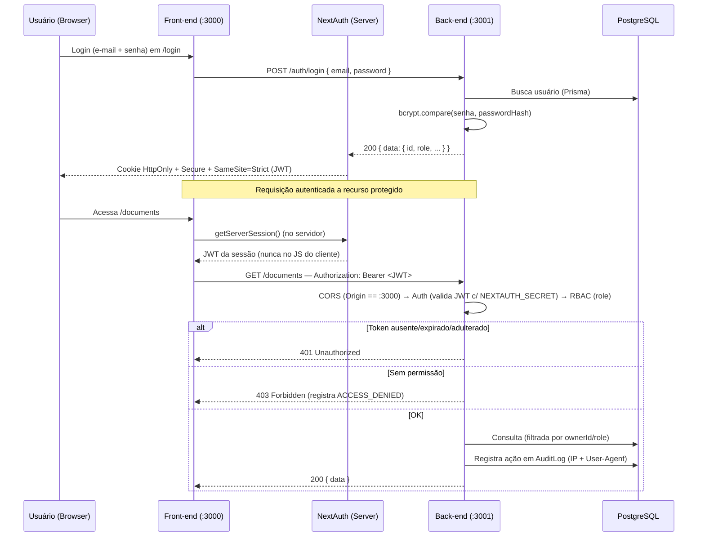

# 📄 Relatório Técnico Parcial — Arquitetura do Sistema Draft

| Campo | Valor |
|---|---|
| **Projeto** | Draft — Gestão de Documentos (P06-B) |
| **Disciplina** | Segurança da Informação (N3) — Prof. Edson Vaz Lopes |
| **Instituição** | Católica SC — Engenharia de Software |
| **Frente** | SecOps e Documentação — Evidências e Planos de Continuidade |
| **Responsável** | Vinícius Steuernagel |
| **Escopo** | Arquitetura **atual** (entrega parcial — checkpoint técnico) |

---

## 1. Visão Geral

O **Draft** é uma aplicação web para gestão de documentos fictícios (contratos e termos) com versionamento, fluxo de aprovação, responsáveis e histórico de alterações. Segue o princípio de **Security by Design**: a separação física entre interface e API, a autenticação por token e a trilha de auditoria forense são parte do desenho, não acréscimos posteriores.

A arquitetura é **desacoplada em dois repositórios Next.js 14 (App Router)**:

- **`draft-frontend` (:3000)** — apenas interface React (sem API Routes); gerencia a sessão e faz chamadas autenticadas ao back-end.
- **`draft-backend` (:3001)** — apenas API Routes (sem interface); valida tokens, aplica regras de negócio e acessa o banco via Prisma.

---

## 2. Arquitetura em Alto Nível

```
Browser (usuário)
  │
  ▼
┌──────────────────────────┐    HTTP/JSON  +  Authorization: Bearer <JWT>
│  FRONT-END  (:3000)      │ ───────────────────────────────────────────────▶ ┌──────────────────────────┐
│  Next.js 14 (App Router) │                                                    │  BACK-END  (:3001)       │
│  • React + Tailwind      │ ◀─────────────────────────────────────────────── │  Next.js 14 (API Routes) │
│  • NextAuth.js v5        │              JSON { data | error }                 │  • CORS restrito         │
│  • Sessão (cookie seguro)│                                                    │  • Middleware Auth (JWT) │
└──────────────────────────┘                                                    │  • Middleware RBAC       │
                                                                                │  • Zod (validação)       │
                                                                                │  • bcryptjs (hash)       │
                                                                                └────────────┬─────────────┘
                                                                                             │ Prisma ORM
                                                                                             ▼
                                                                                ┌──────────────────────────┐
                                                                                │  PostgreSQL (SQLite local)│
                                                                                └──────────────────────────┘
```

| Camada | Tecnologia | Responsabilidade |
|---|---|---|
| Front-end UI | Next.js 14, React, Tailwind | Interface, sessão, proteção de rotas |
| Back-end API | Next.js 14 (API Routes) | Autenticação, autorização, regras de negócio |
| Validação | Zod | Validação de todos os inputs nas API Routes |
| Hash de senha | bcryptjs | Senhas nunca em texto puro |
| ORM | Prisma | Abstração e migrations do banco |
| Banco | PostgreSQL (SQLite local) | Persistência |
| Sessão | NextAuth.js v5 | Cookie seguro + JWT |

---

## 3. Modelo de Dados (Prisma)

| Entidade | Função | Campos-chave |
|---|---|---|
| **User** | Usuários e perfis | `passwordHash` (bcrypt), `role` |
| **Document** | Documento/contrato | `status`, `currentVersion`, `ownerId`, `assignedToId` |
| **DocumentVersion** | Histórico imutável de versões | `versionNumber`, `content`, `createdById` |
| **AuditLog** | Trilha forense | `action`, `userId`, `ipAddress`, `userAgent` |
| **Comment** | Comentários do analista | `documentId`, `authorId`, `content` |

**Perfis (RBAC):** `COLABORADOR` (cria/submete os próprios docs), `ANALISTA` (revisa, aprova/rejeita docs em `EM_REVISAO`), `ADMINISTRADOR` (acesso total + usuários + logs).

**Fluxo de aprovação:** `RASCUNHO → EM_REVISAO → APROVADO / REJEITADO`.

---

## 4. Fluxo de Autenticação e Comunicação Cross-Origin



**Pontos-chave de AppSec no fluxo:**
- O JWT é extraído **no servidor** (`getServerSession`) e injetado como `Authorization: Bearer <JWT>`, nunca trafegando pelo JavaScript do cliente.
- Como front (:3000) e back (:3001) são origens diferentes, a *Same-Origin Policy* impede cookies automáticos; por isso a estratégia **Bearer Token**.
- O back-end compartilha o **`NEXTAUTH_SECRET`** com o front para validar a assinatura do token.
- **CORS rígido** no back-end aceita apenas `Origin: http://localhost:3000`.

---

## 5. Controles de Segurança (AppSec)

| Controle | Onde | Mitiga |
|---|---|---|
| **Hash de senha (bcryptjs)** | Back-end / `User.passwordHash` | Vazamento de credenciais em texto puro |
| **Autorização por perfil (RBAC)** | Middleware em todas as API Routes | Escalonamento de privilégios |
| **Autorização por dono do recurso** | Endpoints de documento (`ownerId === userId`) | **BOLA/IDOR** (acesso a documento alheio) → 403 |
| **Validação no servidor (Zod)** | Início de cada handler | Injeção / payloads malformados → 400 |
| **Cookie blindado** | NextAuth (`HttpOnly`, `Secure`, `SameSite=Strict`) | XSS (roubo de sessão) e CSRF |
| **Bearer Token server-side** | Front extrai JWT via `getServerSession` | Vazamento de token para o JS do cliente |
| **CORS restrito** | Middleware do back-end | Acesso direto à API por origens não autorizadas |
| **Logs de auditoria forense** | `AuditLog` com `ipAddress` + `userAgent` | Perda de rastreabilidade / quebra de Não-Repúdio |
| **Gestão de segredos** | `.env` no `.gitignore` + `.env.example` versionado | Exposição de `DATABASE_URL` / `NEXTAUTH_SECRET` |

---

## 6. Mapeamento com o Framework NIST

Os controles acima cobrem as cinco funções do framework de cibersegurança do NIST, dando continuidade ao plano de controles definido no checkpoint conceitual:

| Função | Como o Draft atende |
|---|---|
| **Identificar** | Definição dos 3 perfis (COLABORADOR, ANALISTA, ADMINISTRADOR), matriz de permissões e classificação dos ativos (senhas, contratos, dados cadastrais, `AuditLog`, segredos). |
| **Proteger** | Hash bcrypt, validação Zod no servidor, gestão de segredos (`.env` fora do Git + `.env.example`), cookies `HttpOnly`/`Secure`/`SameSite=Strict` e CORS restrito. |
| **Detectar** | Trilha de auditoria forense (`AuditLog`) com `ipAddress` e `userAgent`, registrando ações sensíveis como `LOGIN`, `ACCESS_DENIED`, `APPROVE`, `REJECT` e `DELETE_DOC`. |
| **Responder** | Plano Mínimo de Resposta a Incidente (credencial exposta, `.env` vazado e vazamento do banco). |
| **Recuperar** | Plano de Backup e Restauração (dump do PostgreSQL + migrations do Prisma versionadas), reconstruindo o sistema a partir do repositório e dos segredos guardados com segurança. |

---

## 7. Estado Atual (caráter parcial)

A base de autenticação, a estrutura de pastas do front-end e a API estão implementadas. Conforme o checkpoint técnico (22/06), o back-end (`draft-backend`) já está versionado no GitHub, restando a integração final das telas do colaborador e do fluxo de aprovação.

**Pendências em fechamento:**
- [ ] Merge das partes de front-end (formulário de criação e telas de detalhe/RBAC visual).
- [ ] Substituir os *mock data* da listagem de documentos pela API real.
- [ ] Telas de administração: `/admin/users` e `/admin/logs`.
- [ ] Ajustes de metadados do `layout.tsx` e `lang="pt-BR"`.

---

> **Conclusão parcial:** o sistema implementa os pilares de um web app seguro — autenticação com sessão server-side, autorização por perfil e por dono do recurso, validação no servidor, isolamento cross-origin e trilha de auditoria forense. A evolução deve preservar esses controles à medida que os módulos restantes são integrados.
